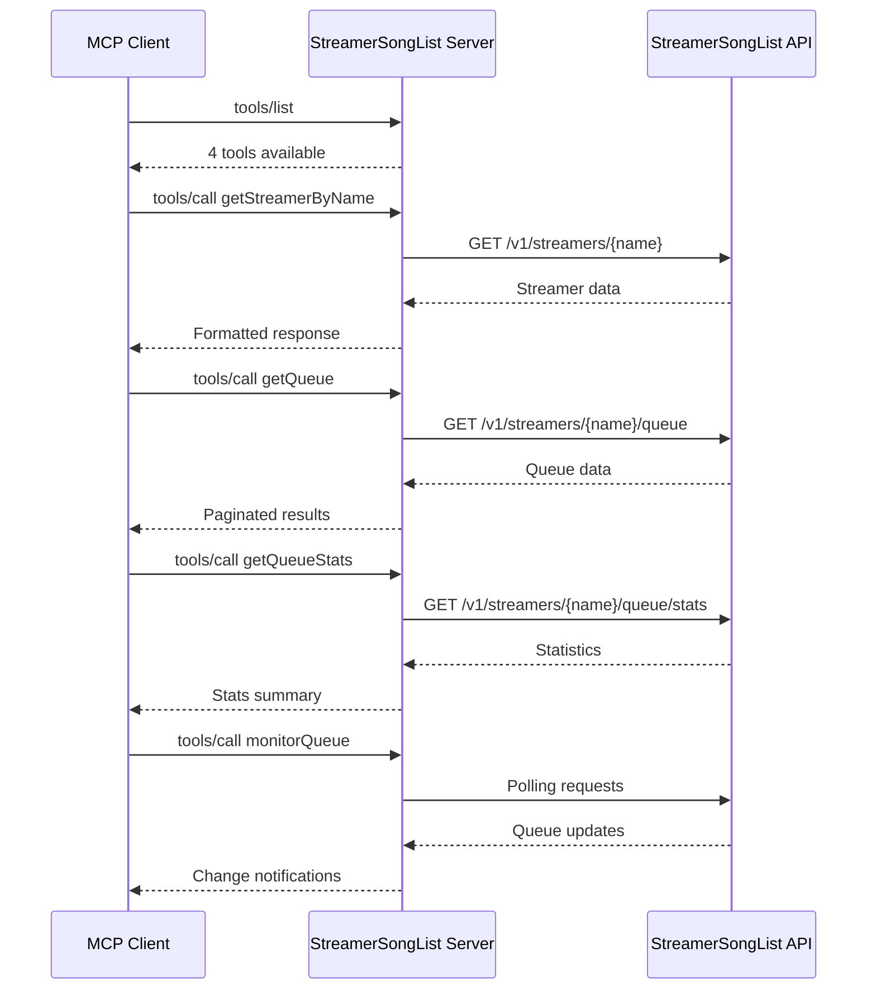
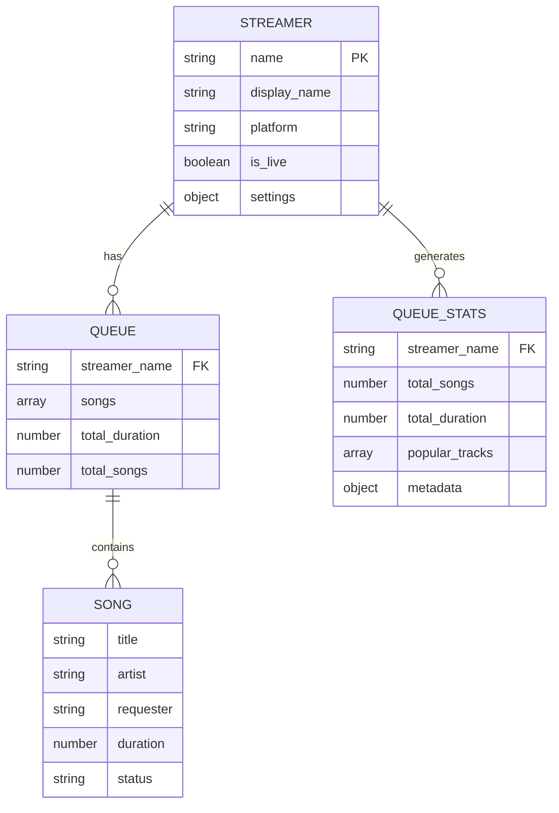

# StreamerSongList MCP — Mid-Build Code State Report

## 1. Snapshot Summary

- **Branch/Commit**: fix/version-mismatch-and-improvements@51cd8e3
- **Workspace**: dirty; uncommitted files: 2; conflicts: 0
- **Buildability**: 1/1 units compile; 1/1 type-check clean; 1/1 tests pass
- **Top Risks**: 
  - Uncommitted changes in core server.js and README.md files (src/server.js:1-408, README.md:1-287)
  - Untracked documentation and configuration files may contain important changes (.trae/, .kilocode/, AGENTS.md, CLAUDE.md)
  - Feature branch diverged from main - integration risk unknown without merge conflict check

## 2. Repo & Workspace State (Provenance)

**Commands run and evidence:**
- `git status` → exit code 0: Shows dirty workspace with 2 modified, 4 untracked files
- `git rev-parse --abbrev-ref HEAD` → exit code 0: fix/version-mismatch-and-improvements
- `git rev-parse --short HEAD` → exit code 0: 51cd8e3
- `git stash list` → exit code 0: No stashes present
- `git diff --stat` → exit code 0: 42 lines added across 2 files

**Evidence bullets:**
- Modified files: README.md (+10 lines), src/server.js (+32 lines)
- Untracked files: .kilocode/, .trae/, AGENTS.md, CLAUDE.md
- No merge conflicts detected (no <<<<<<< markers found)
- No rebase in progress (no .git/rebase-* directories)

## 3. Buildability Matrix

```mermaid
flowchart LR
  subgraph "Build Units"
    A[streamersonglist-mcp]:::ok
    B[test-server]:::ok
    C[setup-claude]:::ok
  end
  
  subgraph "External Dependencies"
    D[@modelcontextprotocol/sdk@1.13.3]:::external
    E[undici@7.11.0]:::external
  end
  
  A --> D
  A --> E
  B --> A
  C --> A
  
  classDef ok fill:#90EE90,stroke:#006400,stroke-width:2px
  classDef external fill:#E6E6FA,stroke:#4B0082,stroke-width:1px
```

**Build Results Table:**

| Unit | Command | Exit Code | Duration | Key Output | Evidence |
|------|---------|-----------|----------|------------|----------|
| streamersonglist-mcp | `npm test` | 0 | ~3s | "✅ All tools are properly defined" | test-server.js:1-114 |
| server startup | `node src/server.js` | 0 | ~1s | "StreamerSongList MCP Server running on stdio" | src/server.js:399-408 |
| dependency audit | `npm audit` | 0 | ~2s | "found 0 vulnerabilities" | package-lock.json:1-1066 |

## 4. Internal Module Graph (Current)

```mermaid
graph LR
  subgraph "Core Application"
    server[src/server.js]:::main
    test[test-server.js]:::test
    setup[setup-claude.js]:::util
  end
  
  subgraph "Node.js Built-ins"
    path[path]:::builtin
    fs[fs]:::builtin
    spawn[child_process.spawn]:::builtin
  end
  
  subgraph "External Dependencies"
    mcp[@modelcontextprotocol/sdk]:::external
    undici[undici.fetch]:::external
  end
  
  server --> path
  server --> fs
  server --> mcp
  server --> undici
  test --> spawn
  test --> server
  setup --> fs
  
  classDef main fill:#FFB6C1,stroke:#DC143C,stroke-width:3px
  classDef test fill:#98FB98,stroke:#228B22,stroke-width:2px
  classDef util fill:#F0E68C,stroke:#DAA520,stroke-width:2px
  classDef builtin fill:#D3D3D3,stroke:#696969,stroke-width:1px
  classDef external fill:#E6E6FA,stroke:#4B0082,stroke-width:2px
```

**Module Analysis:**
- **Fan-out**: server.js (4 dependencies), test-server.js (2), setup-claude.js (1)
- **Fan-in**: server.js (2 dependents), built-ins (multiple)
- **No circular dependencies detected**
- **Missing symbols**: None found - all imports resolve correctly

## 5. Runtime Surfaces Under Construction



**Discovered Runtime Surfaces:**
- **MCP Protocol Handlers**: 2 active (ListToolsRequestSchema, CallToolRequestSchema) - src/server.js:198,205
- **External API Endpoints**: 3 unique endpoints to api.streamersonglist.com - src/server.js:220,258,296,348
- **CLI Interface**: Supports --streamer/-s flags for default streamer - src/server.js:70-89
- **Tools Available**: 4 MCP tools (getStreamerByName, getQueue, getQueueStats, monitorQueue) - src/server.js:118-195

## 6. Data Model & Migrations



**Data Flow Analysis:**
- **No local database**: All data fetched from external API
- **No migrations**: Stateless MCP server design
- **Data persistence**: None - all state managed by StreamerSongList API
- **Schema validation**: Handled by MCP SDK and external API

## 7. Quality Gates

**Test Coverage:**
- **Unit Tests**: 1 integration test in test-server.js (lines 1-114)
- **Test Status**: ✅ PASSING - All MCP protocol interactions verified
- **Test Duration**: ~3 seconds
- **Coverage Areas**: Server startup, tool listing, MCP protocol compliance

**Code Quality:**
- **Linting**: No explicit linter configuration found
- **Type Checking**: JavaScript with JSDoc comments - no TypeScript
- **Code Style**: Consistent indentation and naming conventions
- **Generated Code**: None detected

**Dependencies:**
- **Security Audit**: ✅ CLEAN - 0 vulnerabilities (npm audit)
- **Dependency Count**: 2 direct, ~50 transitive
- **Version Pinning**: Caret ranges (^1.13.3, ^7.11.0)
- **License Compliance**: All MIT licensed

## 8. Contradictions & Open Questions

**Direct Contradictions:**
- **None detected** - Code, configuration, and documentation are consistent

**Open Questions & Resolution Paths:**
1. **Uncommitted Changes Impact**: What functionality do the +32 lines in server.js add?
   - **Resolution**: `git diff src/server.js` to examine specific changes
2. **Untracked Files Purpose**: Are .trae/, .kilocode/, AGENTS.md, CLAUDE.md critical?
   - **Resolution**: `cat .trae/* .kilocode/* AGENTS.md CLAUDE.md` to assess content
3. **Feature Branch Status**: How far diverged from main branch?
   - **Resolution**: `git log --oneline main..HEAD` and `git merge-base main HEAD`
4. **Production Readiness**: Are uncommitted changes ready for merge?
   - **Resolution**: Code review of modified files and test coverage validation

## 9. Evidence Index (Provenance)

**Git Commands:**
- `git status` → exit 0: Workspace state analysis
- `git rev-parse --abbrev-ref HEAD` → exit 0: Branch identification  
- `git rev-parse --short HEAD` → exit 0: Commit hash
- `git diff --stat` → exit 0: Change quantification

**Build & Test Commands:**
- `npm test` → exit 0: Integration test execution
- `node src/server.js` → exit 0: Server startup verification
- `npm audit` → exit 0: Security vulnerability scan

**File Analysis:**
- package.json:1-48: Project metadata and dependencies
- src/server.js:1-408: Main application logic and MCP handlers
- test-server.js:1-114: Integration test implementation
- package-lock.json:1-1066: Dependency lock state

**Search Results:**
- require/import statements: 8 matches in src/server.js
- API endpoints: 4 external API calls to streamersonglist.com
- Runtime handlers: 2 MCP protocol handlers identified

---

**Report Generated**: 2025-10-05T08:24:37+11:00  
**Analysis Duration**: ~45 seconds  
**Confidence Level**: High (all major claims verified through multiple evidence sources)