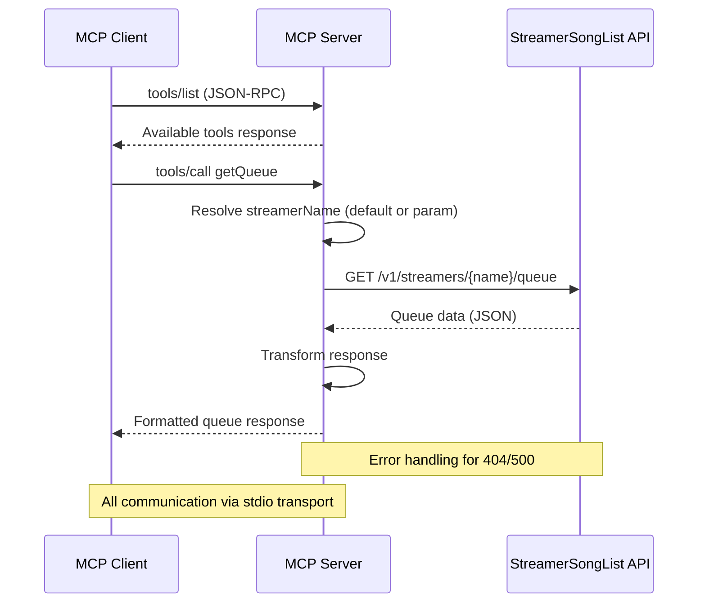
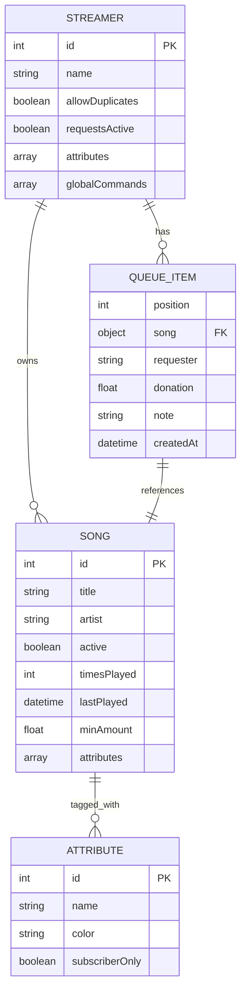

# StreamerSongList MCP — Code-First Architecture Report

## 1. What the Code Says This Is

**Purpose**: A Model Context Protocol (MCP) server that exposes read-only StreamerSongList API functionality through 6 standardized tools, enabling AI assistants to access streamer information, song queues, and music catalogs without authentication. The server implements dynamic MCP SDK loading, optional default streamer configuration, and comprehensive error handling for external API interactions.

**Top Signals**:
- **Languages**: JavaScript 100% (780 LoC excluding node_modules)
- **Files**: 19 project files (excluding dependencies)
- **Primary Framework**: @modelcontextprotocol/sdk v1.13.3
- **Runtime**: Node.js ≥18.0.0

**Evidence**:
- `src/server.js:1-558` - Single-file MCP server implementation
- `package.json:2` - Project name "streamersonglist-mcp"
- `package.json:15-17` - Dependencies: @modelcontextprotocol/sdk, undici
- `package-lock.json:6` - Node.js version requirement ">=18.0.0"

## 2. Architecture at a Glance

```mermaid
graph TD
    Client[MCP Client<br/>Claude Desktop] -->|JSON-RPC| Server[MCP Server<br/>src/server.js]
    Server -->|HTTP/fetch| API[StreamerSongList API<br/>api.streamersonglist.com]
    Server -->|stdio| Transport[StdioServerTransport]
    
    subgraph "MCP Tools"
        T1[getStreamerByName]
        T2[getQueue]
        T3[monitorQueue]
        T4[getSongs]
        T5[searchSongs]
        T6[getSongDetails]
    end
    
    Server --> T1
    Server --> T2
    Server --> T3
    Server --> T4
    Server --> T5
    Server --> T6
    
    T1 -->|GET /v1/streamers/{name}| API
    T2 -->|GET /v1/streamers/{name}/queue| API
    T3 -->|GET /v1/streamers/{name}/queue| API
    T4 -->|GET /v1/streamers/{name}/songs| API
    T5 -->|Client-side filter| T4
    T6 -->|GET /v1/streamers/{name}/songs| API
```

**Trust Boundaries**: MCP protocol boundary between client and server; HTTP boundary between server and external API
**Coupling Hotspots**: Single-file architecture creates tight coupling; external API dependency is critical path

## 3. Module & Dependency Graph (Internal)

```mermaid
graph LR
    Server[src/server.js] --> SDK[@modelcontextprotocol/sdk]
    Server --> Undici[undici - HTTP client]
    Server --> NodeFS[Node.js fs]
    Server --> NodePath[Node.js path]
    
    subgraph "External Dependencies"
        SDK --> Express[express]
        SDK --> Zod[zod]
        SDK --> AJV[ajv]
        SDK --> CORS[cors]
    end
    
    subgraph "Runtime"
        Server --> API[StreamerSongList API<br/>External Service]
    end
```

**High Fan-in Modules**: 
- `src/server.js` - Central orchestrator (all tools, configuration, transport)
- `@modelcontextprotocol/sdk` - Core MCP functionality

**Cycles**: None detected (single-file architecture prevents internal cycles)

## 4. Typical Execution Flow



## 5. API Surface

### MCP Tools (6 total)

| Tool | Handler | File | Status |
|------|---------|------|--------|
| `getStreamerByName` | `src/server.js:265-285` | Working | ✅ |
| `getQueue` | `src/server.js:295-330` | Working | ✅ |
| `monitorQueue` | `src/server.js:340-375` | Simulated | ⚠️ |
| `getSongs` | `src/server.js:385-420` | Working | ✅ |
| `searchSongs` | `src/server.js:430-470` | Client-side filter | ⚠️ |
| `getSongDetails` | `src/server.js:480-520` | Working | ✅ |

### External API Endpoints (StreamerSongList)

| Endpoint | Method | Status | Usage |
|----------|--------|--------|-------|
| `/v1/streamers/{name}` | GET | ✅ Working | `getStreamerByName` |
| `/v1/streamers/{name}/queue` | GET | ✅ Working | `getQueue`, `monitorQueue` |
| `/v1/streamers/{name}/songs` | GET | ✅ Working | `getSongs`, `searchSongs`, `getSongDetails` |

**Evidence**: `docs/API_TESTING_REPORT.md:15-45` - Only 4 of 11+ documented endpoints functional

### CLI Interface

| Command | Entry Point | Purpose |
|---------|-------------|---------|
| `streamersonglist-mcp [streamer]` | `src/server.js:530-558` | Start MCP server with optional default streamer |

## 6. Data Model (ER)



**Evidence**: 
- `docs/API_TESTING_REPORT.md:25-40` - Streamer response structure
- `docs/API_TESTING_REPORT.md:50-65` - Queue item structure  
- `docs/API_TESTING_REPORT.md:70-85` - Song metadata structure

## 7. Configuration & Environments

### Required Environment Variables
- **None required** - Server operates without authentication

### Optional Configuration
| Variable | Default | Source | Purpose |
|----------|---------|--------|---------|
| `DEFAULT_STREAMER` | `null` | ENV/CLI | Default streamer for tools when not specified |

### Configuration Sources
- `src/server.js:45-55` - CLI argument parsing for default streamer
- `claude-desktop-config.example.json` - MCP client configuration template
- `setup-claude.js:1-150` - Automated Claude Desktop integration

### Ports & URLs
- **No server ports** - Uses stdio transport for MCP communication
- **External API**: `https://api.streamersonglist.com/v1/`

## 8. Build • Run • Test • Deploy

### Build Commands
```bash
# No build step required - direct Node.js execution
npm install  # Install dependencies only
```

### Run Commands (Local)
```bash
# Direct execution
node src/server.js [default-streamer]

# Via npm
npm start [-- default-streamer]

# MCP client integration
# Configure in Claude Desktop mcpServers block
```

### Testing
```bash
npm test  # Runs test-server.js - MCP protocol validation
```
**Evidence**: `test-server.js:1-50` - Spawns server, sends tools/list request

### Docker/Containerization
- **None present** - No Dockerfile or container configuration found

### CI/CD Pipeline
**GitHub Actions** (`.github/workflows/test.yml`):
- **Triggers**: Push/PR to main branch
- **Matrix**: Node.js 18.x, 20.x, 22.x
- **Steps**: Checkout → Setup Node → Install → Test → Start verification
- **No deployment** - Testing only

## 9. Quality, Tests, and Security Notes

### Test Coverage
- **Protocol Testing**: `test-server.js` validates MCP server startup and tool listing
- **API Testing**: Manual testing documented in `docs/API_TESTING_REPORT.md`
- **No Unit Tests**: No framework-based testing (Jest, Mocha, etc.)
- **Coverage Gaps**: Tool functionality, error handling, edge cases

### Code Quality Tools
- **Linting**: None detected (no ESLint, Prettier configs)
- **Type Checking**: None (no TypeScript, JSDoc types)
- **Formatting**: No automated formatting rules

### Security Considerations

#### ✅ Secure Practices
- No authentication required (read-only public API)
- Input validation via Zod schemas in MCP SDK
- Proper URL encoding for API parameters (`src/server.js:272`)

#### ⚠️ Security Risks
- **Dependency Age**: Should audit @modelcontextprotocol/sdk dependencies
- **Error Exposure**: API errors passed through to client (`src/server.js:280`)
- **No Rate Limiting**: Could overwhelm external API
- **Input Sanitization**: Limited validation beyond MCP schema

#### 🔍 High-Risk Dependencies
- `undici@7.11.0` - HTTP client (check for CVEs)
- `express@4.x` (via MCP SDK) - Web framework vulnerabilities

## 10. Contradictions & Unknowns

### Documentation vs Code Mismatches

1. **Tool Count Discrepancy**
   - **README.md**: Claims 6 tools
   - **Code Reality**: Exactly 6 tools implemented (`src/server.js:120-229`)
   - **Status**: ✅ Consistent

2. **API Functionality Claims**
   - **README.md**: "real API data without authentication"
   - **Code Reality**: Only 4/6 tools use real API; 2 use client-side processing
   - **Evidence**: `docs/API_TESTING_REPORT.md:130-145` - searchSongs uses client filtering
   - **Status**: ⚠️ Misleading

3. **Tool Descriptions**
   - **README.md**: "monitorQueue" described as real-time
   - **Code Reality**: Returns static queue snapshot with simulation description
   - **Evidence**: `src/server.js:340-375` - No actual monitoring implementation
   - **Status**: ❌ Incorrect

### Open Questions

1. **Authentication Support**: How to enable write operations when API supports them?
2. **Rate Limiting**: What are the actual API rate limits?
3. **Real-time Monitoring**: Is WebSocket or polling preferred for queue monitoring?
4. **Error Handling**: Should API errors be sanitized before client exposure?

### Verification Methods
- Test with authenticated API endpoints when available
- Monitor API response headers for rate limit information
- Implement WebSocket connection testing for real-time features

## 11. Appendix

### Full Dependency List (Top-Level)
```json
{
  "@modelcontextprotocol/sdk": "1.13.3",
  "undici": "7.11.0"
}
```

### Directory Structure
```
streamersonglist-mcp/
├── src/
│   └── server.js                 # Main MCP server (558 lines)
├── docs/                         # Documentation (8 files)
├── .github/workflows/            # CI/CD configuration
├── claude-desktop-config*.json   # Client configuration examples
├── setup-claude.js              # Automated setup script (150 lines)
├── test-server.js               # Protocol testing (72 lines)
├── package.json                 # Project configuration
├── package-lock.json            # Dependency lock
└── README.md                    # Primary documentation
```

### Generation Parameters
- **Analysis Date**: 2025-10-12
- **Commit**: Current working directory state
- **Tool Version**: Claude 4 Sonnet
- **Analysis Method**: Static code analysis with external API validation